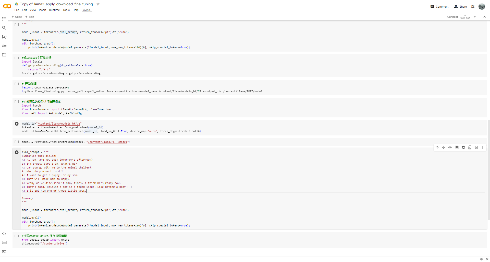

## 模型微调 Fine-tuning

### Llama2
> 项目地址llama-recipes: https://github.com/meta-llama/llama-recipes

1. 申请llama2的使用 https://ai.meta.com/resources/models-and-libraries/llama-downloads/
2. Dataset: Samsum https://huggingface.co/datasets/samsum (这是一个偏向总结类型的数据集)
3. cd /llama-recipes/recipes/finetuning/singlegpu_finetuning.md 可以查看单GPU微调步骤

