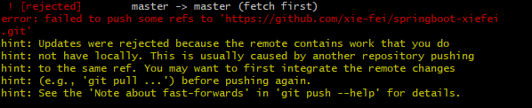

>🤵: Jin OuYang
:email:: ouyangjin334@gmail.com
:timer_clock:: 2022-05-11 15:45:35
:book:: Git 学习笔记

什么是Git?
[wiki](https://zh.wikipedia.org/wiki/Git) 👍
[google](https://git-scm.com/) 👍

### 安装GIT(略)
### 仓库绑定

1. 生成.ssh文件
`ssh-keygen -t rsa`
2. 进入.ssh文件中，将该文件内容拷贝至 [github](https://github.com/ayjin-dev/)
`copy id_rsa.pub`
3. 检查是否连接成功，如下图即成功链接
`ssh -T git@github.com` 


### Git模型

Remote Directory 远程仓库，即Github Repo
History 本地仓库，还没Push到远程仓库
Stage(Index) 即暂存区，还没commit到本地仓库
Working Directory 即你本地代码存放的文件夹


所以我们的工作流程就是，也就对应着文件拥有四种状态:
1. 创建文件，在Working中Coding | filestauts:Untracked
2. 然后给到暂存区`git add .` filestauts:Untracked -> Modified
3. 再上传到本地仓库`git commit` filestauts:Modified -> Staged
4. 上传到Github`git push` filestauts:Staged

文件的四种状态
* Untracked: 未跟踪, 此文件在文件夹中, 但并没有加入到git库, 不参与版本控制. 通过git add 状态变为Staged.
* Unmodify: 文件已经入库, 未修改, 即版本库中的文件快照内容与文件夹中完全一致. 这种类型的文件有两种去处, 如果它被修改, 而变为Modified. 如果使用git rm移出版本库, 则成为Untracked文件
* Modified: 文件已修改, 仅仅是修改, 并没有进行其他的操作. 这个文件也有两个去处, 通过git add可进入暂存staged状态, 使用git checkout 则丢弃修改过, 返回到unmodify状态, 这个git checkout即从库中取出文件, 覆盖当前修改 !
* Staged: 暂存状态. 执行git commit则将修改同步到库中, 这时库中的文件和本地文件又变为一致, 文件为Unmodify状态. 执行git reset HEAD filename取消暂存, 文件状态为Modified


### 常用命令
1. 创建新的仓库
`git init`
2. 克隆远程仓库
`git clone *[url]`
3. 查看文件状态 
`git status [filename]`
4. 添加文件到暂存区
`git add [filename](.表示全部文件)`
5. 提交到本地仓库
`git commit -m "注释信息"`
6. 提交到远程仓库
`git push`


### 忽略文件
在主目录下建立".gitignore"文件，此文件有如下规则：
忽略文件中的空行或以井号（#）开始的行将会被忽略。
可以使用Linux通配符。例如：星号（*）代表任意多个字符，问号（？）代表一个字符，方括号（[abc]）代表可选字符范围，大括号（{string1,string2,...}）代表可选的字符串等。
如果名称的最前面有一个感叹号（!），表示例外规则，将不被忽略。
如果名称的最前面是一个路径分隔符（/），表示要忽略的文件在此目录下，而子目录中的文件不忽略。
如果名称的最后面是一个路径分隔符（/），表示要忽略的是此目录下该名称的子目录，而非文件（默认文件或目录都忽略）。
```python
*.txt        #忽略所有 .txt结尾的文件,这样的话上传就不会被选中！
!lib.txt     #但lib.txt除外
/temp        #仅忽略项目根目录下的TODO文件,不包括其它目录temp
build/       #忽略build/目录下的所有文件
doc/*.txt    #会忽略 doc/notes.txt 但不包括 doc/server/arch.txt
```


### git分支
这部分引用狂神的git进行解释。
分支在GIT中相对较难，分支就是科幻电影里面的平行宇宙，如果两个平行宇宙互不干扰，那对现在的你也没啥影响。不过，在某个时间点，两个平行宇宙合并了，我们就需要处理一些问题了！


常用命令
1. 列出所有本地分支
`git branch`
2. 列出所有远程分支
`git branch -r`
3. 新建一个分支，但依然停留在当前分支
`git branch [branch-name]`
4. 新建一个分支，并切换到该分支
`git checkout -b [branch]`
5. 合并指定分支到当前分支
`git merge [branch]`
6. 删除分支
`git branch -d [branch-name]`
7. 删除远程分支
`git push origin --delete [branch-name]`
`git branch -dr [remote/branch]`


### git配置命令
1. 查看Git配置
`git config -l == git config -list `
2. 查看本地全局配置,如用户名、邮箱.
`git config --global --list`


### 日常使用记录
1. 关于提示`git push --set-upstream origin dev`的问题。⏲️2022-05-11
```
这是作者在本地创建了一个新的dev分支想直接git push到github上面时返回的提示，经过资料查阅得知，这是因为作者原仓库仅存在master分支，导致无法追溯到我想push的dev分支，所以需要set-upstream origin，这里的origin表示创建`git push origin xxx`表示创建xxx分支并上传，set-upstream表示关联到改分支。
综上所述，`git push --set-upstream origin dev`表示创建dev分支并设置为上游分支。
```
2. 关于分支dev同步到master分支中。⏲️2022-05-11
```
1. 先切换到dev分支，git checkout dev 
2. 然后拉取远程dev分支代码 git pull 
3. 切换回主分支 git checkout master
4. 合并分支 git merge dev
5. 上传到远程代码 git push
```
3. 关于问题2`git merge`后`git push`中出现的问题。⏲️2022-05-11

```
原因：github上面的版本与本地版本冲突
解决方案：`git push -u origin master -f` 强行覆盖(注意此企业中慎用，可能会造成远程数据丢失！)
```
