## 概述

数据管理

> 人工管理：
>
> 文件系统管理：
>
> 数据库系统管理：
>
> | 111111111111 | 人工管理               | 文件系统管理         |      | 数据库管理                                             |
> | :----------: | ---------------------- | -------------------- | ---- | ------------------------------------------------------ |
> |   处理方式   | 批处理                 | 联机实施处理、批处理 |      | 联机实时处理、分布处理、批处理                         |
> | 数据共享程度 | 无共享、冗余度极大     | 共享性差、冗余度大   |      | 共享性高、冗余度小                                     |
> | 数据的独立性 | 不独立，完全依赖于程序 | 独立性差             |      | 具有高度的物理独立性一定的逻辑独立性                   |
> | 数据控制能力 | 应用程序自己控制       | 应用程序自己控制     |      | 由数据库系统提供数据安全性、完整性、并发控制和恢复能力 |
>
> 
>
> 
>
> > DBMS数据库管理系统体系结构
> >
> > * 用户视图（外部级）-外模式
> > * 全局视图（概念级）-概念模式
> > * 存储视图（内部级）-内模式
> >
> > 其中外模式和概念模式--逻辑独立性
> >
> > 概念模式和内膜是--物理独立性
> >
> > 逻辑独立性和物理独立性共同保证了数据独立性

## 数据库概念

> 数据库：数据库是长期存储在**计算机**内，**有组织的、统一管理的、可共享的相关数据的集合**

> 数据库管理系统

> 数据库系统

## 数据库系统体系结构

> 三级模式结构
>
> > 外模式：
>
> > 概念模式
>
> > 内模式

## MYSQL

> RDBMS-Relational Databases Management System
>
> >mysql网页 关系型数据库
> >
> >mongodb非关系型数据库结构
> >
> >redis缓存
> >
> >**那么关系型数据库与非关系的区别呢？**
> >
> >举个例子：
> >
> >而关系型数据库用在哪里呢？类似于长期存储的规律性数据。
> >
> >oracle\mysql\ms sql server\sqlite
> >
> >非关系型：爬虫爬下来的数据，爬了两个域名完全不一样的网站，这两个网站的数据最好用Mongodb因为完全没关系。拓展表格很方便。
>
> 关系型数据库管理系统（管理数据库的软件）
>
> 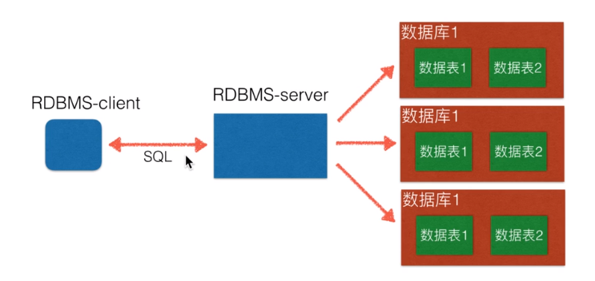
>
> 从左到右
>
> RDBMS-client:客户端进行数据库的操作发送，与RDBMS-server通过 HTTP、TCP/IP协议进行数据传输，通过SQL语句进行数据库控制。
>
> RDBMS-server：从客户端发送的SQL语句中接受指令并对数据库进行指令操作。
>
> 数据库1：即数据库的原始数据，内涵数据表、结构等等。
>
> 
>
> **SQL语句**
>
> > SQL语句主要分为：
> >
> > data query language
> >
> > 数据 查询 语言
> >
> > * **DQL：数据查询语言。select**
> > * **DML:数据操作。insert\update\delete**
> > * **DDL:数据定义。create\drop**
> > * TPL:事务处理。begin transaction\commit\rollback
> > * DCL:数据控制。grant\revoke
> > * CCL:指针控制。declare cursor
> >
> > 对于web程序员来说，重点是数据的crud（增删改查），必须熟练掌握DQL、DML，能够编写DDL完成数据库、表的操作。
> >
> > SQL是一门特殊的语言，专门用来操作关系数据库。
> >
> > **语句不区分大小写**
>
> 
>
> **数据类型、约束**--->数据完整性
>
> > **创建数据库**
> >
> > 数据库名：随意
> >
> > 字符集：utf8 -- UTF-8 Unicode
> >
> > 排序规则：utf8_general_ci
>
> > 创建表
> >
> > 表的编码默认为数据库编码，可以自行更改
> >
> > 表名：随意
> >
> > **类型：**
> >
> > * 整数：int\bit
> >
> > * 小数：decimal
> >
> >   > decimal(5,2)表示共存取五位数，小数占两位
> >
> > * 字符串：char\varchar
> >
> >   > char:表示固定长度的字符串。char(3)，填充'ab'='ab '
> >   >
> >   > varchar:表示可变长度的字符串。varchar(3),'ab'='ab'
> >
> > * text：存放字符大于4000时推荐使用的类型 
> >
> > * 如果是图片、视频、音乐，选择路径存放。
> >
> > * 日期时间：date\time\datetime
> >
> >   > date:2020-01-01
> >   >
> >   > time:12:29:46
> >   >
> >   > datetime:2020-01-01 12:29:46
> >   >
> >   > year:2017
> >
> > * 枚举类型：enum
> >
> > * 还有许多类型可以搜索
> >
> > 长度：
> >
> > 小数点：
> >
> > 不是null:是否为空
> >
> > 主键：唯一标记每一行的记录
> >
> > 
> >
> > 约束：
> >
> > * 主键primary key:外键foreign key:
> >
> >   > 简单来说：
> >   >
> >   > 主键：是这每组数据中唯一一个能定位到这一组数据的元素。
> >   >
> >   > 外键：这一组元素中该数据是另一个表中的主键，则称为外键。
> >   >
> >   > 
> >   >
> >   > 一、什么是主键、外键：
> >   >
> >   > 关系型[数据库](http://lib.csdn.net/base/mysql)中的一条记录中有若干个属性，若其中某一个属性组(注意是组)能唯一标识一条记录，该属性组就可以成为一个主键 
> >   > 比如 
> >   > 学生表(学号，姓名，性别，班级) 
> >   > 其中每个学生的学号是唯一的，学号就是一个主键 
> >   > 课程表(课程编号,课程名,学分) 
> >   > 其中课程编号是唯一的,课程编号就是一个主键 
> >   > 成绩表(学号,课程号,成绩) 
> >   > 成绩表中单一一个属性无法唯一标识一条记录，学号和课程号的组合才可以唯一标识一条记录，所以 学号和课程号的属性组是一个主键 
> >   >
> >   > 成绩表中的学号不是成绩表的主键，但它和学生表中的学号相对应，并且学生表中的学号是学生表的主键，则称成绩表中的学号是学生表的外键 
> >   >
> >   > 同理 成绩表中的课程号是课程表的外键 
> >   >
> >   > 定义主键和外键主要是为了维护关系数据库的完整性，总结一下：
> >   > 1.主键是能确定一条记录的唯一标识，比如，一条记录包括身份正号，姓名，年龄。
> >   >
> >   > 身份证号是唯一能确定你这个人的，其他都可能有重复，所以，身份证号是主键。 
> >   > 2.外键用于与另一张表的关联。是能确定另一张表记录的字段，用于保持数据的一致性。
> >   >
> >   > 比如，A表中的一个字段，是B表的主键，那他就可以是A表的外键。
> >
> > * 非空not null:字段不允许为空
> >
> > * 唯一unique:字段不允许重复
> >
> > * 默认default:字段可使用默认值
>
> ## 命令行操作mysql
>
> > **数据库操作**
> >
> > 可以安装mycli辅助学习sql语句
> >
> > pip install -i https://pypi.tuna.tsinghua.edu.cn/simple mycli
> >
> > mycli -localhost -uroot即可登录
> >
> > ## 数据库
> >
> > > 链接数据库:mysql -uroot -p
> > >
> > > 退出：exit or quit or Ctrl+D
> > >
> > > 查看数据库: show databases;
> > >
> > > 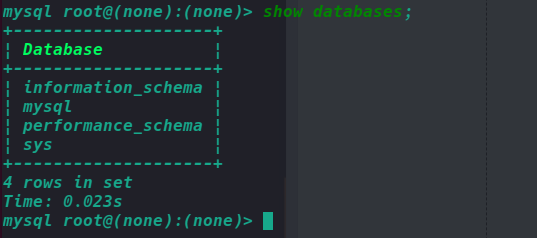
> > >
> > > 使用该数据库：use 数据库名;
> > >
> > > 查看当前时间：select now()
> > >
> > > 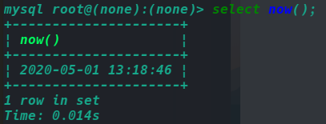
> > >
> > > 查看数据库版本：select version();
> > >
> > > 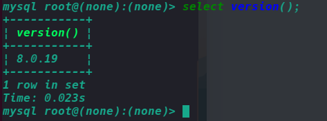
> > >
> > > 创建数据库：create database python04 charset=utf8mb4;
> > >
> > > 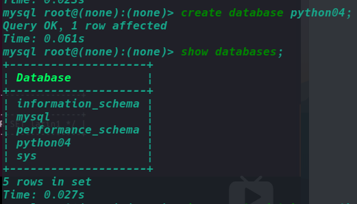
> > >
> > > 查看数据库创建情况：show create database python04;
> > >
> > > 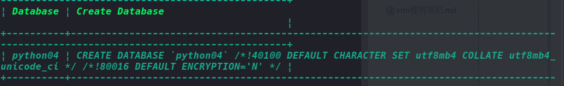
> > >
> > > 删除数据库：drop database python04;
> > >
> > > 如果出现特殊字符的数据库名类似于python-04则需要使用&prime;python-04&prime;进行删除drop database &prime;python04&prime;;
> > >
> > > 修改数据库结构：alter databases python_test character set utf8mb4;
> >
> > 
> >
> > ## 数据表
> >
> > > 先选定一个数据库：use xxx;
> > >
> > > 查看已经选择的数据库：select database();
> > >
> > > 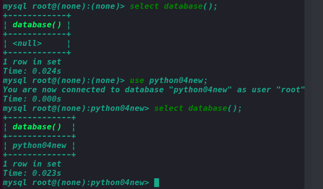
> > >
> > > 查看当前数据库中的所有表：show tables;
> > >
> > > 创建数据表：
> > >
> > > >  `create table xxx(id int, name varchar(30));`
> > > >
> > > > `create table yyy(id int primary key not null auto_increment,name varchar(30));`这里创建了名为yyy的表且名为id这int类型设为主键不允许为空自增长。
> > > >
> > > > 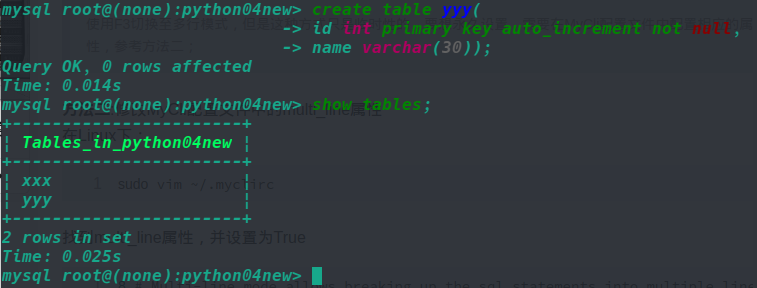
> > >
> > > 查看表的结构：desc xxx;description描述
> > >
> > > 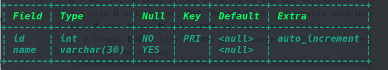
> > >
> > > 实例：创建一个students表（id name age high gender cls_id）
> > >
> > > ```sql
> > > create table students(
> > >  	id int unsigned not null auto_increment primary key,
> > >     name varchar(30),
> > >     age tinyint unsigned,
> > >     high decimal(5,2),
> > >     gender enum("男","女","中性","保密") default "保密",
> > >     cls_id int unsigned
> > > );
> > > ```
> > >
> > > 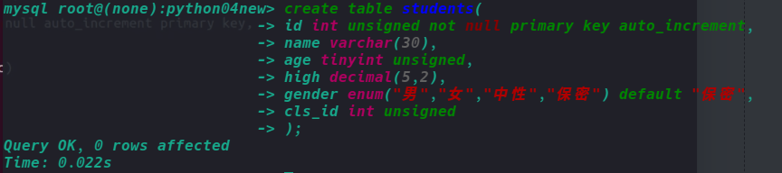
> > >
> > > 插入数据：`insert into students values(0,"wang",18,188.88,"男",26)`
> > >
> > > 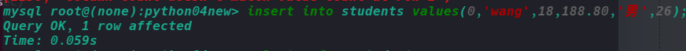
> > >
> > > 查看表中数据：```select * from students;```
> > >
> > > 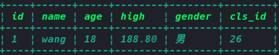
> > >
> > > 查看创建表的语句：show create table students;
> > >
> > > 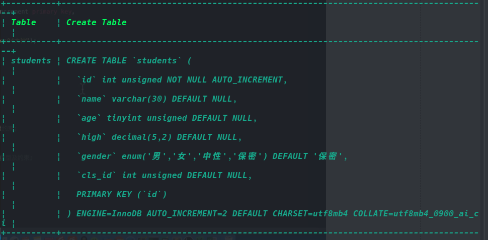
> > >
> > > 修改表结构：
> > >
> > > > 添加字段：alter table students add birthday datetime;
> > > >
> > > > 修改字段：
> > > >
> > > > >  修改字段位置记得一定要带参数
> > > > >
> > > > >  alter table xxx modify column1 [记得带参]
> > > > >
> > > > >  column2;
> > > > >
> > > > >  ex:
> > > > >
> > > > >  alter table areas modify pid varchar(20)
> > > > >
> > > > >  after aid;
> > > > >
> > > > >  增加一个字段并制定位置
> > > > >
> > > > >  **alter** **table** areas **add** types1 tinyint(1) **default** "2" after pid;
> > > > >
> > > > >  alter table students modify birthday date;modify->修改
> > > > >
> > > > >  修改表students中birthday字段数据类型为date.
> > > >
> > > > > alter table students change birthday birth date default "1990-01-01";
> > > > >
> > > > > 修改表students中birthday字段名改为birth且数据类型为date，默认为1990-01-01
> > > > >
> > > > > **修改表名**:alter table classed rename classes;
> > > >
> > > > 删除字段：alter table students drop birthday;
> > > >
> > > > 删除表students中birthday字段
> > >
> > > 删除表：drop table students;
> >
> > ## 数据CURD(create\update\retrieve\delete)
> >
> > > 数据的增删改查
> > >
> > > 增加数据
> > >
> > > > 全部插入：insert into classed values (0,'python');
> > > >
> > > > insert into students values(default,'hap',20,'女',1,'1999-01-02'),(default,'jog',12,'男,2,'1552-01-03')
> > > >
> > > > 部分插入：insert into students(name,gender) values("表格","女")
> > > >
> > > > 多行插入：insert into students(name,gender) values("表格","女")，("表格","女")
> > > >
> > > > 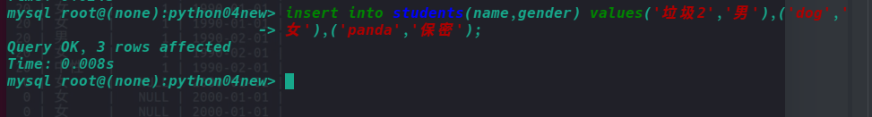
> > >
> > > 修改数据
> > >
> > > > 全部修改：update students set gender='男' ;
> > > >
> > > > 修改id=6的人的性别：update students set gender='男' where id=6;
> > > >
> > > > update students set gender='男',age=22 where id=6;
> > >
> > > 查询数据
> > >
> > > > 查询所有列：select * from students;
> > > >
> > > > 查询指定列：
> > > >
> > > > select name,gender from students;
> > > >
> > > > 使用别名
> > > >
> > > > select name as 姓名, gender as 性别 from students;
> > > >
> > > > 调整输出顺序
> > > >
> > > > select id as 序号, gender as 性别 ,name as 姓名 from students;
> > > >
> > > > 定条件查找：
> > > >
> > > > > 查询名字为jog的：select * from students where name="jog";
> > > > >
> > > > > 查询id>6的：select * from students where id>6;
> > >
> > > 删除数据
> > >
> > > > 物理删除
> > > >
> > > > delete from students;
> > > >
> > > > delete from students where name='jog';
> > > >
> > > > 逻辑删除(常用方法)
> > > >
> > > > alter table students add is_delete bit 'default 0';
> > > >
> > > > update students set is_delete=1 where id=1;
> > >
> > > 查询进阶
> > >
> > > > --创建数据库
> > > >  create database python_test charset=utf8; 
> > > >
> > > > --查看数据库
> > > > show databases; 
> > > >
> > > > --使用数据库
> > > > use python_test;
> > > >
> > > > --显示当前使用那个数据库
> > > >  select database();
> > > >
> > > >  --创建一个数据表
> > > > create table studuent(
> > > >     id int unsigned primary key auto_increment not null,
> > > >     name varchar(20) default '',
> > > >     age tinyint unsigned default 0,
> > > >     height decimal (5,2),
> > > >     gender enum('男', '女', '中性', '保密') default '保密',
> > > >     cls_id int unsigned default 0,
> > > >     is_delete bit default 0
> > > > ); 
> > > >
> > > > create table classes(
> > > >     id int unsigned auto_increment primary key not null,
> > > >     name varchar(30) not null
> > > > ); 
> > > >
> > > > insert into studuent values
> > > >     (0,'小明',18,168.00,2,1,0),
> > > >     (0,'小黄',17,175.00,1,2,0),
> > > >     (0,'小红',14,177.00,2,3,0),
> > > >     (0,'小汉',11,180.00,3,4,0),
> > > >     (0,'小八',12,187.00,3,5,0),
> > > >     (0,'小九',13,182.00,4,6,0),
> > > >     (0,'小十',18,188.00,3,7,0),
> > > >     (0,'小之',17,186.00,2,8,0),
> > > >     (0,'小一',10,188.00,2,9,0),
> > > >     (0,'小二',15,182.00,3,9,0),
> > > >     (0,'小三',18,184.00,2,6,0),
> > > >     (0,'小四',19,185.00,4,4,0),
> > > >     (0,'小五',13,190.00,2,3,0),
> > > >     (0,'小六',14,189.00,2,4,0),
> > > >     (0,'小七',15,178.00,2,5,0),
> > > >     (0,'十一',15,167.00,1,7,0),
> > > >     (0,'十二',18,176.00,1,2,0);
> > > >
> > > > insert into classes values
> > > >     (0, "python01期"),
> > > >     (0, "python02期"),
> > > >     (0, "python04期"); 
> > > >
> > > > select id as 序号,name as 姓名,height as 身高 from students; 
> > > >
> > > > 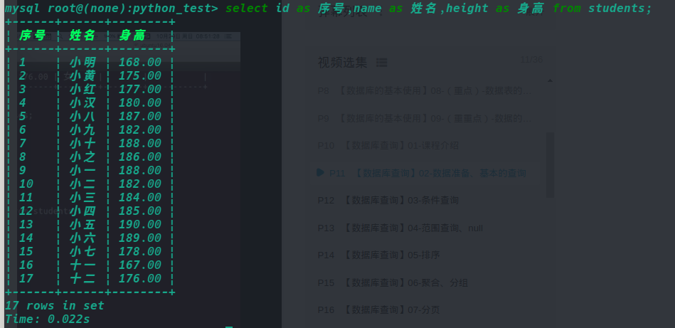
> > >
> > > ## 条件查询
> > >
> > > 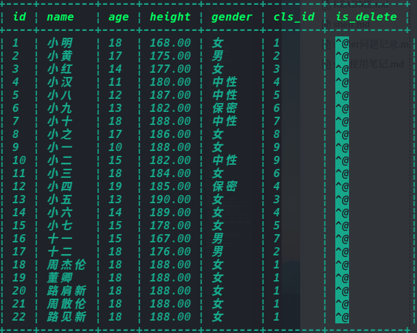
> > >
> > > > 比较运算符`>`>=<=都可以
> > > >
> > > > 查询大于18岁的信息
> > > >
> > > > select * from students where age>18;
> > > >
> > > > select name,gender from students where age>18;
> > >
> > > > 逻辑运算符 and or not
> > > >
> > > > 18-28岁的学生信息
> > > >
> > > > select * from students where age>18 and age<28;
> > > >
> > > > 18岁以上或者身高超过180的
> > > >
> > > > select * from students where age>18 or tall>180;
> > > >
> > > > 不在18岁以上的女性
> > > >
> > > > select * from students where not (age>18 and gender='男');
> > >
> > > > 模糊查询 like rlike
> > > >
> > > > **like: %替换1个或多个 			_替换1个**
> > > >
> > > > 查询姓名中以 小开头的名字
> > > >
> > > > select name from students where name like "小%";
> > > >
> > > > 查询姓名中有 小的所有名字
> > > >
> > > > select name from students where name like "%小%";
> > > >
> > > > 查询有两个字的名字
> > > >
> > > > select name from students where name like "__"
> > > >
> > > > 查询有三个字的名字
> > > >
> > > > select name from students where name like "___"
> > > >
> > > > 查询至少两个字的名字
> > > >
> > > > select name from students where name like "__%"
> > > >
> > > > **rlike:正则表达查找**
> > > >
> > > > 查找以小开始的姓名
> > > >
> > > > select name from students where name rlike "^小.*";
> > > >
> > > > 查找以周开头伦结尾的姓名
> > > >
> > > > select name from students where name rlike "^周.*伦";
> > > >
> > > > 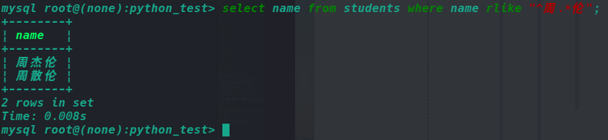
> > >
> > > > 不连续查询
> > > >
> > > > 查找年龄为12、18、34的名字
> > > >
> > > > select name from students where age=12 or age=18 or age=34;
> > > >
> > > > select name from students where age in (12,18,34);
> > > >
> > > > 不是12、18、34的名字
> > > >
> > > > select name from students where age not in (12,18,34);
> > >
> > > > 连续查询between and 
> > > >
> > > > 查找年龄为18～34岁的名字
> > > >
> > > > select name from students where age between 18 and 34;
> > > >
> > > > 查找年龄不为18～34岁的名字
> > > >
> > > > select name from students where age not between 18 and 34;
> > >
> > > > 空判断
> > > >
> > > > 判断身高为空的信息
> > > >
> > > > select * from students where height is null;
> > >
> > > ## 排序
> > >
> > > > order by 字段
> > > >
> > > > asc从小到大 升序(默认)ascend 
> > > >
> > > > desc从大到小 降序descend
> > > >
> > > > 查询年龄在18-34岁之间的男性，按照年龄从小到大排序。
> > > >
> > > > select * from students where (age between 18 and 34) and gender=1;
> > > >
> > > > select * from students where (age between 18 and 34) and gender=1 order by age desc;
> > > >
> > > > 查询年龄在18-34岁之间的女性，按照身高从大到小排序。
> > > >
> > > > select * from students where (age between 18 and 34) and gender=2 order by height desc;
> > > >
> > > > order by 多个字段
> > > >
> > > > 查询年龄在18-34的女性，身高从高到矮，如果身高相同的情况下按照年龄从小到大排序。
> > > >
> > > > select * from students where (age between 18 and 34) and gender=2 order by height desc,age asc,id desc;
> > >
> > > ## 聚合函数
> > >
> > > > 总数count
> > > >
> > > > 查询男性有多少人
> > > >
> > > > select count(*) as 男性人数 from student where gender=1;
> > > >
> > > > 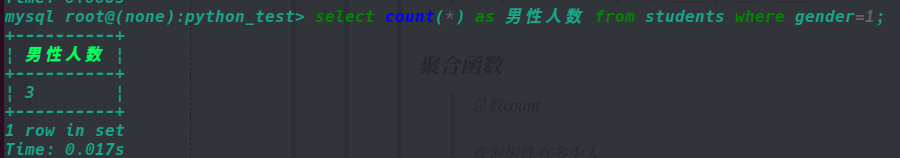
> > > >
> > > > 最大值max,min通用
> > > >
> > > > 查询年龄最大的是谁
> > > >
> > > > select max(age) from students;
> > > >
> > > > 查询女性最高身高
> > > >
> > > > select max(height) from students where gender=2;
> > > >
> > > > 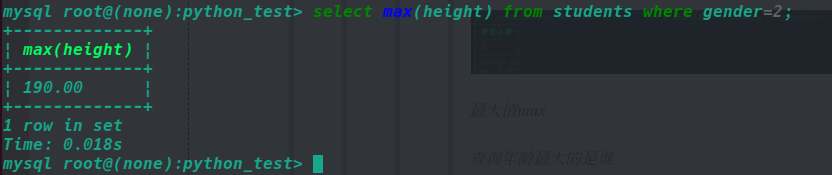
> > > >
> > > > 求和：sum
> > > >
> > > > 求所有人年龄之和
> > > >
> > > > select sum(age) from students;
> > > >
> > > > 求平均值
> > > >
> > > > 求所有人年龄的平均值。
> > > >
> > > > select avg(age) from students;
> > > >
> > > > 四舍五入round(data,2)保留两位
> > > >
> > > > 求所有人年龄的平均值。
> > > >
> > > > select round(abg(age),2) from students;
> > >
> > > ## 分组
> > >
> > > > group by
> > > >
> > > > 按照性别分组，统计处各个性别的人数分配。
> > > >
> > > > select  gender,count(*) from students group by gender;
> > > >
> > > > 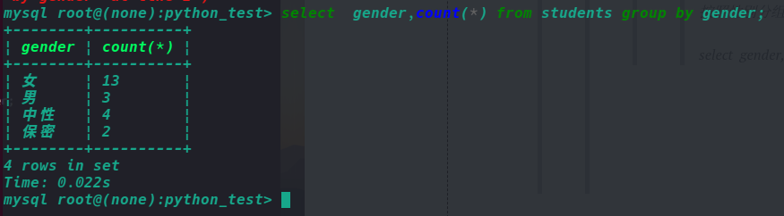
> > > >
> > > > 按照性别分组，统计处各个性别有哪些人。
> > > >
> > > > group_concat(name,age...)可以查看多种
> > > >
> > > > select gender,group_concat(name) from students group by gender;
> > > >
> > > > 
> > > >
> > > > 按照性别分组，统计处各个性别的年龄分配.
> > > >
> > > > select gender,avg(age) from students group by gender;
> > > >
> > > > 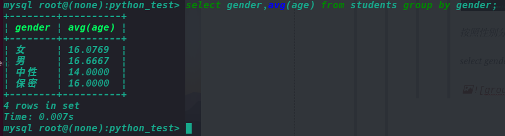
> > > >
> > > > 男性的详细信息
> > > >
> > > > select gender,group_concat(name,'_',age,'_',id) from students where gender=1 group by gender;
> > > >
> > > > 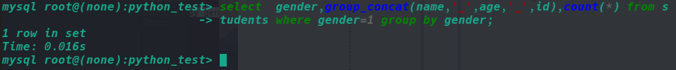
> > > >
> > > > 
> > > >
> > > > having
> > > >
> > > > 查询平均年龄超过30岁的性别，以及姓名。
> > > >
> > > > select gender,group_concat(name) from students group by gender having avg(age)>30;
> > > >
> > > > 查询每种性别中的人数多于两个的信息。
> > > >
> > > > select gender,group_concat(name) from students group by gender having count(*)>2;
> > > >
> > > > **where 和 having的区别：**
> > > >
> > > > where使用分组前的筛选
> > > >
> > > > having 用于分组后的筛选
> > >
> > > ## 分页
> > >
> > > > limit start count
> > > >
> > > > limit限制查询出来的数据个数
> > > >
> > > > select * from students where gender=1 limit2;查找两个女性
> > > >
> > > > select * from students where gender=1 limit 0,5;从第0个开始查找，往下查5个。
> > > >
> > > > select * from students where gender=1 limit 5,5;从第5个开始查找，往下查5个。
> > > >
> > > > select * from students where gender=1 limit 10,5;从第10个开始查找，往下查5个。
> > > >
> > > > 每页显示2个，显示第六页的信息，按照年龄大小排序。
> > > >
> > > > select * from students order by age  limit 10,2;
> > >
> > > ## 连接查询
> > >
> > > > 
> > > >
> > > > 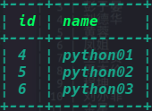
> > > >
> > > > 链接查询：inner join ... on（表与表的链接）
> > > >
> > > > select * from students inner join classes
> > > >
> > > > **交集**-内连接
> > > >
> > > > 查询有能够对应班级的学生以及班级信息
> > > >
> > > > select * from students inner join classes on students.cls_id=classes.id;
> > > >
> > > > 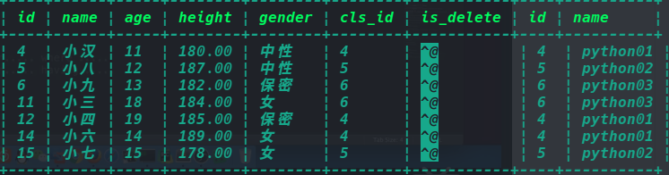
> > > >
> > > > 按要求显示对应另一个表的编号、班级
> > > >
> > > > select students.*, classes.name,classes.id from students inner join classes on students.cls_id=classes.id;
> > > >
> > > > 给数据表起名字
> > > >
> > > > select s.name,c.name from students as s inner join classes as c on s.cls_id=c.id;
> > > >
> > > > 
> > > >
> > > > **并集**
> > > >
> > > > 查询有能够对应班级的学生以及班级信息，按照班级进行排序，若为同班级按照id进行排序。
> > > >
> > > > select c.name, s.* from students as s inner join classses as c on s.cls_id=c.id order by c.name,s.id;
> > > >
> > > > 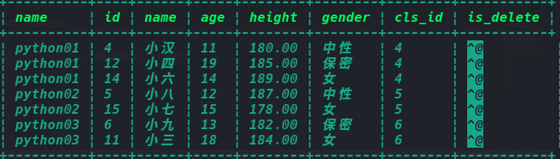
> > > >
> > > > 外连接
> > > >
> > > > 以left join左边为基准，未能匹配则为默认填空
> > > >
> > > > select * from students as s left join classes as c on s.cls_id=c.id;
> > > >
> > > > 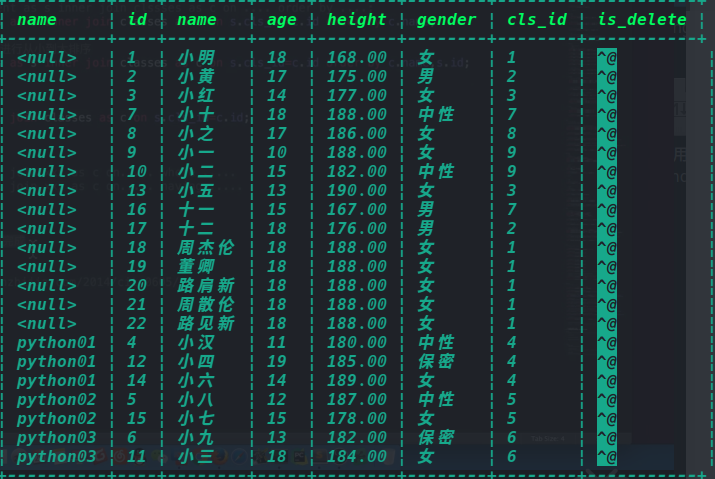
> > > >
> > > > 查询没有对应班级的学生
> > > >
> > > > select * from students as s left join classes as c on s.cls_id=c.id where c.id is null;
> > > >
> > > > 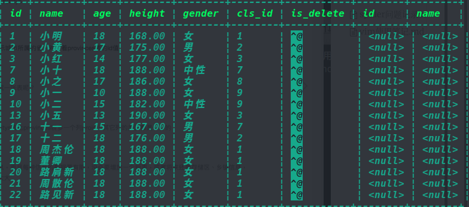
> > >
> > > ## 自关联
> > >
> > > > 表示通过一张表实现逻辑关联查询，类似于省-市-县
> > > >
> > > > 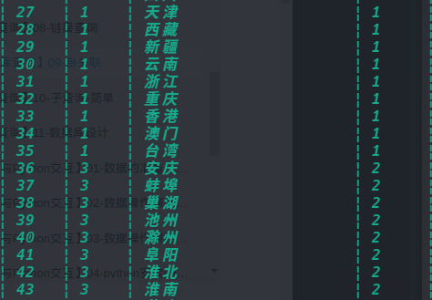
> > > >
> > > > 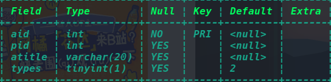
> > >
> > > 子查询
> > >
> > > > 查询江西省有哪些市
> > > >
> > > > select * from areas as province inner join areas as city on city.pid=province.aid having province.atitle="江西";
> > > >
> > > > select province.atitle,city.atitle from areas as province inner join areas as city on city.pid=province.aid having province.atitle="江西";
> > > >
> > > > 查询最高的男生信息
> > > >
> > > > select * from students where height=(select max(height) from students);
> > >
> > > ## 数据库设计
> > >
> > > > * 关系型数据库建议在E-R模型的基础上，我们需要根据产品经理的设计策划，抽取出来模型和关系，制定出表结构。
> > > > * 在开发中右很多设计数据库的软件，常用的入power designer,db designer等，这些软件可以只管得看到实体及实体间的关系。
> > > > * 设计数据库可能由专人来完成，也可能让开发组的人完成。
> > > >
> > > > ## 三范式
> > > >
> > > > * 经过研究和对使用中的问题的总结，对于设计数据库提出了一些规范，这些规范称为范式。
> > > >
> > > > * 目前有迹可循的共有8种范式，一般需要遵守3范式即可
> > > >
> > > >   > * 第一范式
> > > >   > * 第二范式
> > > >   > * 第三范式
> > > >
> > > > **E-R模型**：Entity-relationship model实体联系模型
> > > >
> > >
> > > ## 实战
> > >
> > > > 数据准备
> > > >
> > > > create database jing_dong charset = utf8mb4;
> > > >
> > > > use jing_dong;
> > > >
> > > > # 商品表
> > > > create table goods(
> > > >     id int unsigned primary key auto_increment not null,
> > > >     name varchar(150) not null,
> > > >     cate_name varchar(40) not null, #类别名
> > > >     brand_name varchar(50) not null, #品牌名
> > > >     price decimal(10,3) not null default 0,
> > > >     is_show bit not null default 1, #是否显示
> > > >     is_saleoff bit not null default 0 #是否售馨
> > > > );
> > > >
> > > > insert into goods values (0,'r510vc 15.6英寸笔记本','笔记本','华硕','3399',default,default),
> > > >                          (0,'y400n 14.0英寸笔记本电脑','笔记本','联想','4999',default,default),
> > > >                          (0,'g150th 15.6英寸笔记本','游戏本','雷神','8499',default,default),
> > > >                          (0,'x550cc 15.6英寸笔记本','笔记本','华硕','2799',default,default),
> > > >                          (0,'x240 超级本','超级本','联想','4880',default,default),
> > > >                          (0,'u330p 13.3英寸超级本','超级本','联想','4299',default,default),
> > > >                          (0,'svp13226scb 触控超级本','超级本','索尼','7999',default,default),
> > > >                          (0,'ipad mini 7.9英寸平板电脑','平板电脑','苹果','1998',default,default),
> > > >                          (0,'ipad air 9.7英寸平板电脑','平板电脑','苹果','3388',default,default),
> > > >                          (0,'ipad mini 配备retina显示屏','平板电脑','苹果','2788',default,default),
> > > >                          (0,'ideacentre c340 20英寸一体电脑','台式机','联想','3499',default,default),
> > > >                          (0,'vostro 3800-r1206 台式电脑','台式机','戴尔','2899',default,default),
> > > >                          (0,'imac me086ch/a 21.5英寸一体电脑','台式机','苹果','9188',default,default),
> > > >                          (0,'at7-7414lp 台式电脑 linux','台式机','苹果','3699',default,default),
> > > >                          (0,'z220sff f4f06pa工作站','服务器/工作站','惠普','4288',default,default),
> > > >                          (0,'powereedge ii服务器','服务器/工作站','戴尔','5388',default,default),
> > > >                          (0,'mac pro专业级台式电脑','服务器/工作站','苹果','28888',default,default),
> > > >                          (0,'hmz-t3w 头戴显示设备','笔记本配件','索尼','6999',default,default),
> > > >                          (0,'商务双肩背包','笔记本配件','索尼','99',default,default),
> > > >                          (0,'x3250 m4机架式服务器','服务器/工作站','ibm','6888',default,default),
> > > >                          (0,'商务双肩背包','笔记本配件','索尼','99',default,default);
> > > >
> > > > select * from goods;
> > > >
> > > > 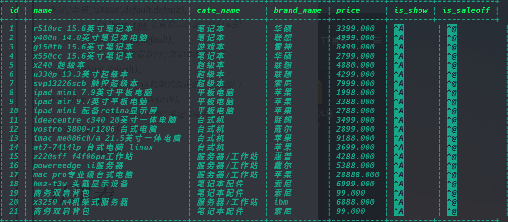
> > > >
> > > > SQL语句实战：
> > > >
> > > > * 1查找超级本：select * from goods where cate_name='笔记本';
> > > > * 2查看品牌的分类：select distinct brand_name from goods;
> > > >
> > > > 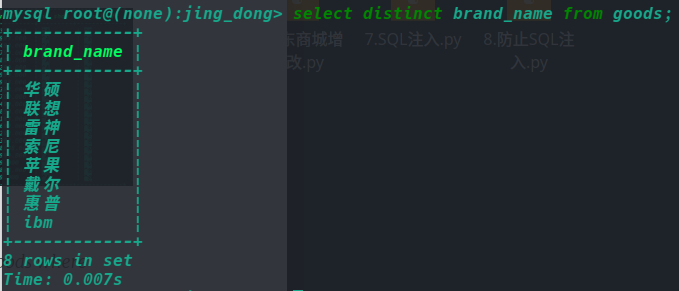
> > > >
> > > > * 3求所有电脑的平均价格：select avg(price) from goods;
> > > >
> > > > * 4求所有电脑的平均价格并保留2位小数：
> > > >
> > > >   select round(avg(price),2) from goods;
> > > >
> > > > * 5显示每种商品的平均价格：
> > > >
> > > >   **select** cate_name,avg(price) **from** goods **group** **by** cate_name; 
> > > >
> > > >   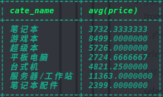
> > > >
> > > > * 6显示每种类型的商品中，最贵、最便宜、平均价、数量：select cate_name,max(price) as 最贵,min(price) as 最便宜,avg(price) as 平均,count(*) as 数量 from goods group by cate_name;
> > > >
> > > > * 查询所有价格大于平均价格的商品，并且按价格降序排序：
> > > >
> > > >   select id,name,price from goods where price > (select round(avg(price),2) as avg_price from goods) order by price desc;
> > > >
> > > >   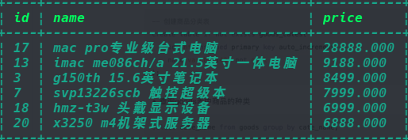
> > > >
> > > > * 查询每种最贵的商品的信息：
> > > >
> > > >   select * from (select cate_name,max(price) as max_price from goods group by cate_name) as g_new left join goods as g on g_new.cate_name=g.cate_name and g_new.max_price=g.price;
> > > >
> > > >   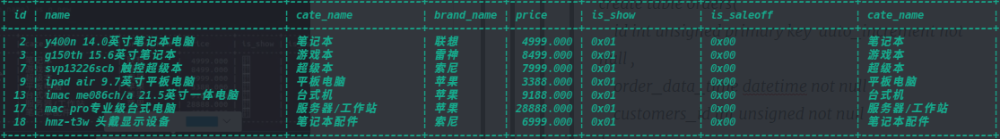
> > > >
> > > > ## 商品分类表
> > > >
> > > > * create table if not exists goods_cates(
> > > >
> > > >   id int unsigned primary key auto_increment,name varchar(40) not null);
> > > >
> > > > * 查询goods表中商品的种类
> > > >
> > > >   select cate_name from goods group by cate_name;
> > > >
> > > > * 将分组结果写入到goods_cates数据表中
> > > >
> > > >   insert into goods_cates(name) **select cate_name from goods group by cate_name;**注意这里不用values
> > > >
> > > >   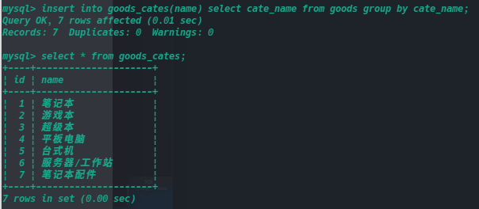
> > > >
> > > > * 同步表数据通过goods_cates数据表来更新goods表
> > > >
> > > > * update goods as g inner join goods_cates as c on g.cate_name=c.name set g.cate_name=c.id;
> > > >
> > > > 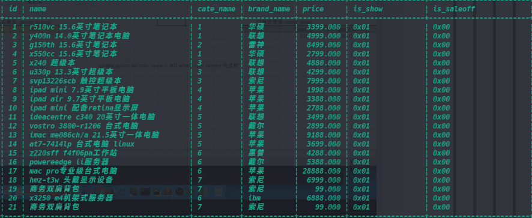
> > > >
> > > > * 更改表结构：alter table good change cate_name cate_id int unsigned not null;
> > > >
> > > > * 设置外键。关联cate_id和表goods_cate的id
> > > >
> > > >   alter table goods add foreign key (cate_id) references goods_cates(id);
> > > >
> > > > 练习题：
> > > >
> > > > > create table goods_brands(
> > > > >
> > > > > id int unsigned primary key auto_increment,
> > > > >
> > > > > name varchar(40) not null) select brand_name as name from goods group by brand_name;
> > > > >
> > > > > 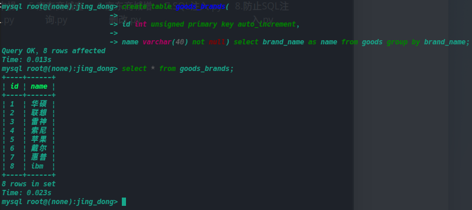
> > > > >
> > > > > update goods as g inner join goods_brands as b on g.brand_name=b.name set g.brand_name=b.id;
> > > > >
> > > > > **alter** **table** goods **change** brand_name brand_id int **unsigned** **not** null;
> > > > >
> > > > > 最后添加外键
> > > > >
> > > > > alter table goods add foreign key (brand_id) references goods_brands(id);
> > > > >
> > > > > 取消外键约束
> > > > >
> > > > > show create table goods;
> > > > >
> > > > > alter table goods drop foreign key 外键名称;
> > > >
> > > > 
> > > >
> > > > 
> > > >
> > > > ## 订单表
> > > >
> > > > create table orders(
> > > >     id int unsigned primary key  auto_increment not null ,
> > > >     order_data_time datetime not null ,
> > > >     customers_id int unsigned not null
> > > > )
> > 
> > 
> >
> > 
> >
> > 

### 补充

union

将两个输出结果联合到一张表上

select * from xxx where id = 1 union select 2,databases();

